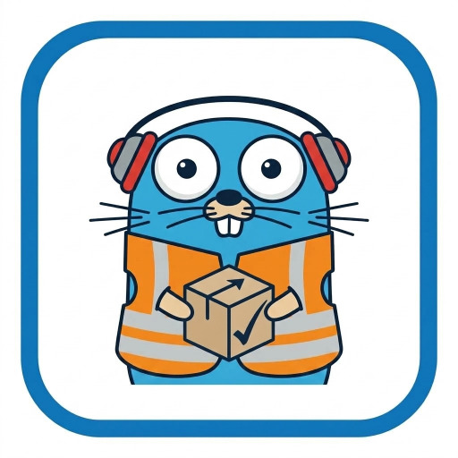

[](https://github.com/gabay/responder/actions)

<div align="center">
  
</div>

# Responder

A [Traefik](https://traefik.io) **provider plugin** that lets you declare static HTTP
responses directly in the Traefik static configuration. Any request matching a
configured [Traefik rule](https://doc.traefik.io/traefik/routing/routers/#rule) is
short-circuited: it never reaches a real backend, and instead gets back the
configured body (or file contents), status code, and headers.

Traefik plugins are developed using the [Go language](https://golang.org).
Rather than being pre-compiled and linked, however, plugins are executed on the fly by
[Yaegi](https://github.com/traefik/yaegi), an embedded Go interpreter.

## Usage

For a plugin to be active for a given Traefik instance, it must be declared in the static configuration.

```yaml
# Static configuration

experimental:
    plugins:
        responder:
            moduleName: github.com/gabay/responder
            version: v0.2.0

providers:
    plugin:
        responder:
            defaultStatus: 204
            defaultHeaders:
                Access-Control-Allow-Origin: "*"
            responses:
                - rule: Host(`example.com`) && Path(`/heartbeat`)
                  body: "OK"
                  status: 200
                  priority: 10
                  middlewares:
                      - my-middleware@file
                - rule: Host(`another.example.com`)
                  file: dynamic-response.txt
```

### Configuration reference

Each entry under `responses` supports:

| Field         | Required | Description                                                                                                                 |
| ------------- | -------- | --------------------------------------------------------------------------------------------------------------------------- |
| `rule`        | yes      | A standard Traefik routing rule, e.g. ``Host(`example.com`)``.                                                              |
| `priority`    | no       | Router priority. Falls back to `defaultPriority` when unset.                                                                |
| `body`        | no       | The literal response body. Mutually exclusive with `file`. Falls back to `defaultBody`/`defaultFile` when neither is set.   |
| `file`        | no       | Path to a file on disk whose contents are used as the response body.                                                        |
| `status`      | no       | HTTP status code to return. Falls back to `defaultStatus`, then to `200`.                                                   |
| `headers`     | no       | Map of extra response headers to set. Falls back to `defaultHeaders` when unset.                                            |
| `middlewares` | no       | List of middleware names (e.g. `my-middleware@file`) to apply to the router. Falls back to `defaultMiddlewares` when unset. |

Exactly one of `body` or `file` may be set for a given response (both may be
omitted for an empty body).

At the top level of the plugin configuration, the following `default*` fields
are used as fallbacks for any response that doesn't set the corresponding
field: `defaultPriority`, `defaultBody`, `defaultFile`, `defaultStatus`,
`defaultHeaders`, `defaultMiddlewares`. Each response falls back to these
wholesale (no merging) whenever its own field is unset/empty.

### Local Mode

Traefik also offers a developer mode that can be used for temporary testing of plugins not hosted on GitHub.
To use a plugin in local mode, the Traefik static configuration must define the module name (as is usual for Go packages) and a path to a [Go workspace](https://golang.org/doc/gopath_code.html#Workspaces), which can be the local GOPATH or any directory.

The plugin must be placed in the `./plugins-local` directory, which should be in the working directory of the process running the Traefik binary:

```
./plugins-local/
    └── src
        └── github.com
            └── gabay
                └── responder
                    ├── responder.go
                    ├── responder_test.go
                    ├── go.mod
                    ├── go.sum
                    ├── LICENSE
                    ├── Makefile
                    ├── readme.md
                    └── vendor
                        └── ...
```

```yaml
# Static configuration
# Local mode
entryPoints:
    web:
        address: :80

log:
    level: DEBUG

experimental:
    localPlugins:
        responder:
            moduleName: github.com/gabay/responder

providers:
    plugin:
        responder:
            responses:
                - rule: Host(`example.com`)
                  body: "OK"
```

## How it works

1. Starts a single tiny HTTP server bound to `127.0.0.1` (loopback only),
   local to the Traefik process, that knows how to render every configured
   response.
2. Generates, for every configured response, a Traefik `router` (using your
   `rule`, `priority`, and `middlewares`), a built-in (non-plugin) `headers`
   middleware that tags the request with which response it matched (via an
   internal-only `X-Responder-Id` header that never leaves the
   Traefik process), and a shared `service` that targets the embedded
   server from step 1. Any `middlewares` you configure run first (e.g.
   auth), followed by the tagging middleware right before the request
   reaches the embedded server.
